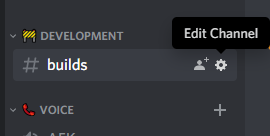
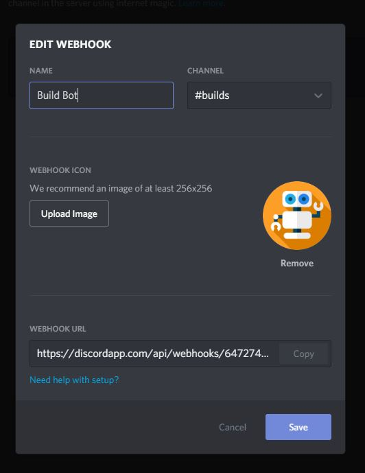
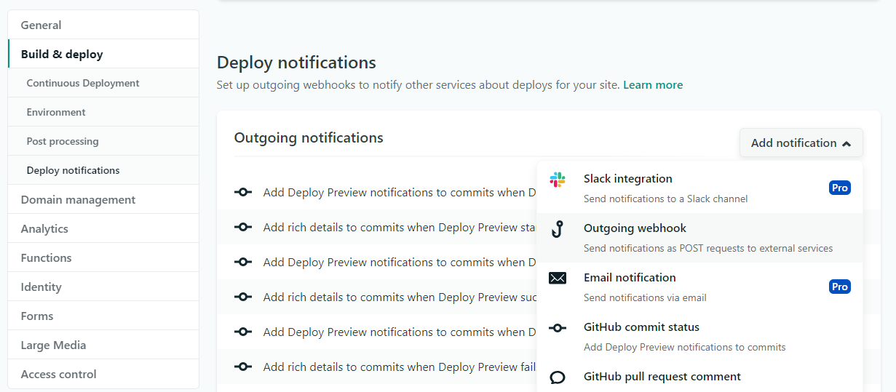
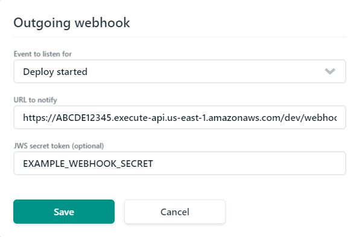

# Netlify webhook consumer for Discord

## Prerequisites

- [Serverless framework](https://serverless.com/)
- [AWS acount](https://aws.amazon.com/)
- [Discord account](https://discordapp.com/register)
- [Netlify account](https://www.netlify.com/)

## Discord

- Create a text channel for builds to be posted to
- Edit the channel

&nbsp;&nbsp;&nbsp;&nbsp;&nbsp;&nbsp;&nbsp;&nbsp;&nbsp;&nbsp;

- Create a webhook. Save the webhook url for later

&nbsp;&nbsp;&nbsp;&nbsp;&nbsp;&nbsp;&nbsp;&nbsp;&nbsp;&nbsp;

## Serverless

- Follow this [guide](https://serverless.com/framework/docs/providers/aws/guide/credentials/) for setting up serverless with AWS
- Navigate to the directory for this repository
- Install dependencies: `yarn`
- Rename `serverless.example.yml` to `serverless.env.yml`
- Change WEBHOOK_SECRET to your desired secret
- Change DISCORD_WEBHOOK_URL to the webhook url from the discord webhook
- Deploy the lambda: `yarn deploy`

```
https://ABCDE12345.execute-api.us-east-1.amazonaws.com/dev/webhook
```

- After a successful deploy copy the url from the terminal output. It will look similar to the example above. We'll need this in Netlify.

## Netlify

- Depoloy a site from a branch
- Add a notification for an outgoing webhook
  &nbsp;&nbsp;&nbsp;&nbsp;&nbsp;&nbsp;&nbsp;&nbsp;&nbsp;&nbsp;
  
- Save
